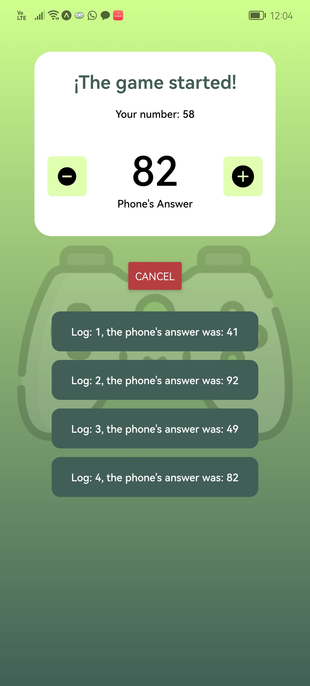
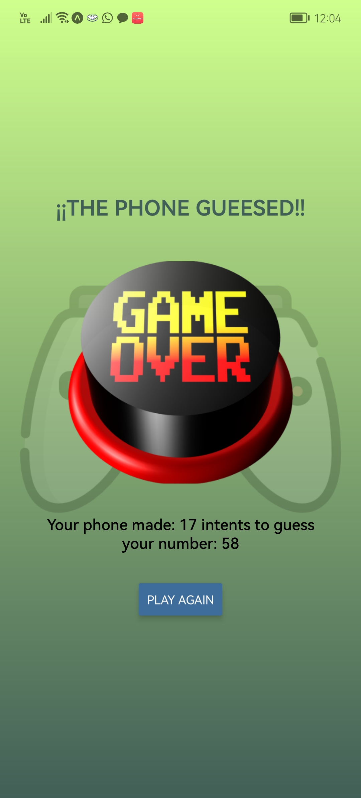

# Guess the number App.

This mobile application was built using React Native.

  

## Description.

As a user, you have to add a number, and your mobile phone will guess the number that you typped.
You will see different screens showing all the logs from the phone and the amount of intents your cellphone made.

  
  
  

## Softwares.

* React Native.
* Docker and Docker Compose.
* VS Code.

## Author.

* Jorge Ortiz.
* Software engineer.
* ortiz.mata.jorge@gmail.com
* San Luis Potosí, S.L.P. México.
